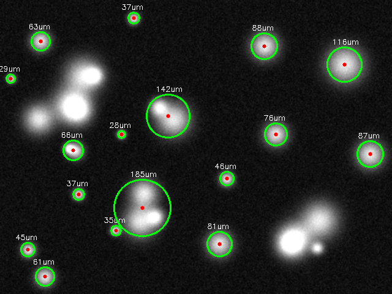

# 💧 Droplet Detection & Size Distribution Pipeline

> Classical computer vision pipeline for spray droplet detection and sizing.  
> Outputs industry-standard **D10/D50/D90** metrics used in spray atomisation research.



---

## How It Works
Raw Image → Gaussian Blur → Otsu Threshold → Contour Detection → Size Distribution

| Stage | File | Purpose |
|-------|------|---------|
| 0 | `synthetic_droplets.py` | Generate synthetic test images with ground truth |
| 1 | `preprocess.py` | Denoise and threshold image into binary mask |
| 2 | `detect.py` | Find droplets via contour detection + circularity filter |
| 3 | `measure.py` | Convert pixel measurements to micrometres |
| 4 | `analyse.py` | Compute D10/D50/D90 and plot size distribution |
| 5 | `pipeline.py` | Run full pipeline end-to-end |

---

## Results

| Metric | Value |
|--------|-------|
| Mean D50 across frames | 78.5 µm |
| Diameter range | 22 – 198 µm |
| Detection rate | 17–19 droplets / frame |

---

## Setup

```bash
git clone https://github.com/GoldenRailgun/droplet-detection-pipeline.git
cd droplet-detection-pipeline
pip install -r requirements.txt
```

## Run

```bash
# Generate synthetic images
python src/synthetic_droplets.py

# Run full pipeline
python src/pipeline.py
```

---

## Key Design Decisions

**Otsu thresholding over fixed threshold** — self-adapts to each frame's lighting conditions.  
**Circularity filter (≥ 0.70)** — rejects merged blobs and noise, keeps only true droplets.  
**Border rejection** — excludes partial droplets at edges that distort size measurements.  
**Calibration-ready** — plug in a mm/pixel ratio from any reference target for real-world units.

---

## Known Limitations

- Overlapping droplets are rejected — watershed segmentation is the planned extension
- Validated on synthetic data — real images may require parameter tuning

---

## Author
**Khush Patel** — aka GoldenRailgun  
[LinkedIn](https://linkedin.com/in/khush-patel-mclaren) · [GitHub](https://github.com/GoldenRailgun)